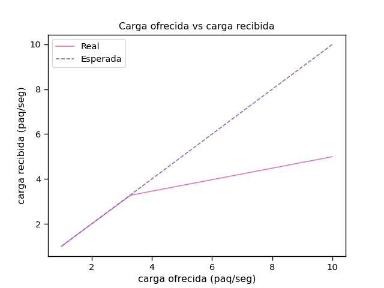
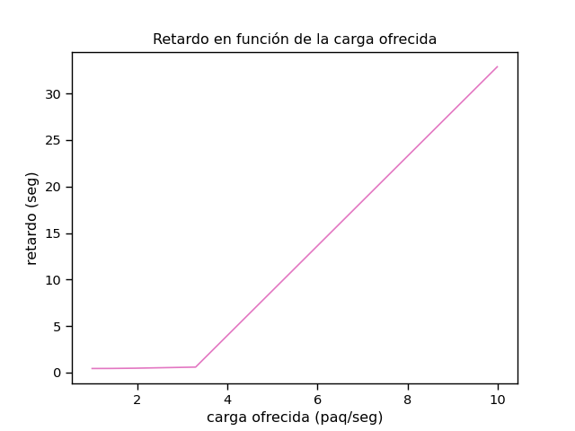
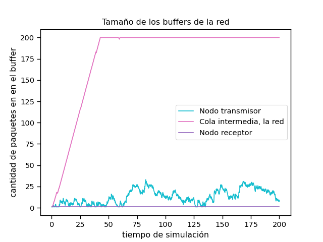
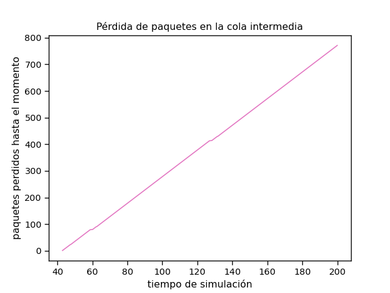

# Análisis y resolución de conflictos de congestión y flujo en redes usando simulaciones discretas.

### Laboratorio 3 - Transporte - Redes y Sistemas Distribuidos - FaMAF - UNC

---
Abordamos problemas de congestión y flujo en tráfico de red bajo tasas de datos acotadas y tamaño de buffers limitados. Para ello trabajamos analizando dos casos particulares que son simulados y modelados en Omnet++, usando un modelo de colas que varía su configuración a medida que avanzamos con los análisis, llegando así a resolver estos problemas mediante algoritmos

### AGREGAR ALGORITMO FINAL

que se encargan de controlarlos

---
## Introducción

El control de flujo y congestión en redes de sistemas es una de las problemáticas centrales de la materia. Tanto el **control de congestión** como el **control de flujo** se encargan de moderar el tráfico entre nodos transmisores, la red y nodos receptores para evitar saturaciones en alguno de los actores y así evitar pérdidas de datos durante la transferencia de información. La diferencia entre uno y otro radica en *qué* actores de la red están involucrados y por lo tanto *qué* actores serán los encargados de gestionar los recursos de forma que se garantice un tráfico confiable y eficiente entre ellos.

La **congestión** se da en la red. Un nodo transmisor envía información a un nodo receptor a través de ella, si esta red no es lo suficientemente rápida y eficiente entonces un transmisor muy rápido podría saturarla, disminuyendo no solo la velocidad de viaje hasta el receptor de esta información sino, ocasionalmente, la cantidad de información enviada en un principio (la red podría descartar información si no fuese capaz de almacenarla hasta poder enviarla). Dadas estas improntas, conlcuimos en que el **control de congestión** involucra al *nodo transmisor* y a *la red*. Como la red es un actor "independiente", el actor encargado de gestionar el tráfico para que esta no se sature es el *nodo transmisor*.

El **control de flujo** es un proceso de extremo a extremo, es decir entre nodo transmisor y nodo receptor. Un transmisor muy rápido podría saturar un receptor muy lento, generando los mismos resultado explicados en el párrafo anterior. Así, concluimos que los actores involucrados son el *nodo transmisor* y el *nodo receptor*, la diferencia es que aquí es el *nodo receptor* quién debe gestionar en qué forma recibe la información del *transmisor*.

Para modelizar estos problemas de control de flujo y congestión utilizamos lo que se llama **simulación discreta**. Las simulaciones discretas buscan representar sistemas cuyas variables de estado cambian únicamente en un conjunto discreto de instantes en el tiempo, por eso usamos Omnet++, con un tiempo limitado de simulación y acumuladores estadísticos que reflejan el cambio de estas variables que se modifican una cierta cantidad de veces *dentro* de ese tiempo. Este tipo de simulaciones es muy útil cuando experimentar con el sistema real es muy complicado y también cuando tenemos la necesidad de analizar ese sistema en tiempo real, ambas utilidades atraviesan las problemáticas tratadas. Unas de las ventajas que más nos benefician es que, una vez que el modelo está construido, se puede utilizar repetidamente para analizar el mismo problema en distintos conextos y que esos contextos pueden ser controlados por el usuario, que es la forma en que abordamos este análisis y luego resolución de los problemas de flujo y congestión en una red.

El sistema simulado a analizar consiste en un modelo de colas conformado por:

1. **Nodo transmisor (NodeTx):** tendrá el generador de paquetes que se enviarán a través de la red y una cola donde esperarán dichos paquetes antes de ser enviados a dicha red. El generador presenta dos parámetros, un *generationInterval* que es el intervalo de generación entre paquetes y un *packetByteSize*, que especifica el tamaño de los paquetes generados (12500 bytes).
   La cola de este nodo tiene un *bufferSize*, que son la cantidad de paquetes que pueden quedarse esperando a ser enviados luego de ser generados, en este caso, 2.000.000; y un *serviceTime*, que es el tiempo que la cola tardará en "procesar" el paquete, es decir, enviarlo.
2. **Cola "intermedia" (Queue):** tiene los mismos parámetros que la cola del nodo transmisor, funciona como un buffer entre el nodo transmisor y el nodo receptor, guardando los paquetes antes de ser enviados al receptor.  Esta cola simula *la red*, mencionada en los párrafos anteriores, por lo tanto, el control que hace de los paquetes que debe transportar **no** está en "nuestras manos". Su *bufferSize* es de 200 paquetes, mucho más limitado que el del nodo transmisor.
3. **Nodo receptor (NodeRx):** tendrá una cola donde esperarán los paquetes antes de ser finalmente enviados al receptor y el receptor en sí mismo. Esta cola tiene los mismos parámetros que las anteriores, su *bufferSize* es igual de limitado que el de *la red* (Queue)

Estos tres actores estan conectados en una red Network. Analizamos su funcionamiento para dos casos de estudio:

+ **Caso de estudio 1:**

  - NodeTx a Queue: *datarate* = 1 Mbps, *delay* = 100 us
  - Queue a NodeRx: *datarate* = 1 Mbps, *delay* = 100 us
  - Queue a Sink: *datarate* = 0.5 Mbps (Dentro del nodo receptor)

+ **Caso de estudio 2:**

  - NodeTx a Queue: *datarate* = 1 Mbps, *delay* = 100 us
  - Queue a NodeRx: *datarate* = 0.5 Mbps, *delay* = 100 us
  - Queue a Sink: *datarate* = 1 Mbps


Para cada uno de los casos corrimos simulaciones paramétricas con:

- *generationInterval* = 0.1s
- *generationInterval* = 0.3s
- *generationInterval* = 0.5s
- *generationInterval* = 0.7s
- *generationInterval* = 1s

Para analizar ambos casos realizamos gráficos en donde se enfrentan la carga ofrecida por el nodo transmisor y la carga recibida por el nodo receptor para cada una de las simulaciones con distintos intervalos de generación de paquetes. Se realizaron dos gráficos en los que se observa que los valores de carga ofrecida y carga recibida para ambos casos (1 y 2) son similares, por lo que decidimos resumirlo en un solo gráfico

kk

En un sistema sin pérdidas ni congestión, la carga recibida debería crecer directamente proporcional a la carga ofrecida. Por lo que vemos en el gráfico, en nuestra simulación esto no ocurre así, dejando en evidencia que a partir de que el nodo transmisor comienza a enviar más de 3 paquetes por segundo hay algun buffer (cola/queue) que comienza a saturarse y a perder paquetes. Realizamos otro gráfico en donde enfrentamos la carga ofrecida con el retardo promedio de los paquetes en llegar al nodo receptor.



Aquí también es claro que, a partir de la generación de 3 paquetes por segundo, los paquetes tardan cada vez más en llegar. Esto refleja, nuevamente, la saturación de algún buffer, haciendo que el/los último/s paquete/s almacenado/s en dicho buffer deban esperar a que este envíe todos los paquetes que hay delante de el/ellos para poder ser enviado/s.

Dados estos gráficos, decidimos, para cada uno de los casos, graficar el tamaño al momento de cada uno de los buffers en la red para ver cuál es el que se está saturando. Usamos un intervalo de generación de paquetes de 0.1s ya que implica la mayor carga ofrecida en nuestras simulaciones y por lo tanto será el caso en donde los buffers estén más exigidos y posiblemente saturados. Será claro en dónde (en qué cola/buffer) está ocurriendo el problema.

### Caso 1


Vemos que el buffer del nodo receptor, luego de aproximadamente 40 segundos, se satura alcanzando su límite de 200 paquetes y se mantiene saturado hasta el final de la simulación. Queda claro que el *cuello de botella* en este caso se encuentra en la cola de el nodo receptor. Vemos un gráfico de los paquetes perdidos a lo largo de toda la simulación en este buffer


A medida que pasa el tiempo, luego de los 40 segundos, el buffer del nodo receptor continúa perdiendo paquetes de forma casi lineal, es decir, podría asumirse que todos los paquetes que llegan a dicha cola son descartados por falta de espacio.

Dados estos gráficos asumimos que el problema para este caso está en el buffer del nodo receptor, sugiriendo un problema de **control de flujo**.

### Caso 2



Lo que sucede en este caso es muy similar a lo ocurrido en el caso 1, pero el problema se observa en la **cola intermedia**, es decir, **la red**. Luego de los 40 segundos el buffer de la red se satura y parece mantenerse saturado hasta el final de la simulación, sugiriendo que cada paquete que llegue a él a partir de ese momento será descartado. Graficamos dicha pérdida para corroborar nuestra suposición



El gráfico es prácticamente igual que el gráfico de paquetes perdidos para el caso 1, pero aquí, como el problema viene de la red, se alude un problema de **control de congestión**

## Algoritmos de **Control de Congestion y Flujo**

Durante las simulaciones realizadas, identificamos dos problemas principales en la red: **pérdida de paquetes** y un **nodo receptor completamente colapsado**. Estos problemas nos enontramos  en los casos tratados1. Para abordar estas problemáticas, diseñamos e implementamos algoritmos que buscan eliminar la congestión y el flujo descontrolado, para un mejor rendimiento.

El **problema de flujo** ocurre cuando el nodo transmisor envía paquetes a una velocidad mayor de la que el nodo receptor puede procesar. Esto genera una acumulación de paquetes en el buffer del receptor, que eventualmente se desborda, resultando en la pérdida de datos. Para resolver este problema, es necesario implementar un mecanismo de control de flujo que permita al receptor regular la velocidad de transmisión del emisor, asegurando que no se envíen más paquetes de los que el receptor puede manejar.

Por otro lado, el **problema de congestión** se presenta cuando la capacidad de la red intermedia (representada por la cola central en nuestras simulaciones) es insuficiente para manejar el tráfico generado por el nodo transmisor. Esto provoca un aumento en el tiempo de espera de los paquetes y, eventualmente, el descarte de los mismos debido a la saturación del buffer. Se requiere un algoritmo de control de congestión que permita al transmisor ajustar dinámicamente su tasa de envío en función de las condiciones de la red.

Con nuestro equipo de trabajo fuimos un poco mas a la hora de implementar un algoritmos que solucione ambos problemas en nuestra pequeña simulacion. Pero esto requeria prevenciòn entoces decidimos tener un algorimto secillo de respaldo (este es solo un esquema bastante bueno de resolucion, que iba  a ser terminado y detallado, si solo si, No lograbamos implementar el algoritmo )


## Implementación Secundaria de los Algoritmos:

Este algorimo consta de agragarle un delay a la cola del nodo transmisor

y pasar de  :
```cpp
scheduleAt(simTime() + 0, endServiceEvent);
```
a capturar y darle cierto tiempo de delay
```cpp
   scheduleAt(simTime() + this->delay, endServiceEvent);
```

Aqui el nodo (transporTx) tiene cierto tiempo para largar los datos, esto ayuda a que la queue real tenga tiempo para procesar paquetes y enviarlos hacia transporRx, y tambien esa espera del inicio hace que la ventana del receptor no se desborde. Se solucionan ambos problemas.

### Como se calcula el delay


TransporRx calcula constantemente el delay del ultimo paquete y le envia ese resultado a transporTx.
```cpp
    feedbackPkt->delay = simTime().dbl() - msg->getCreationTime().dbl();
    send(feedbackPkt, "toOut$o");
```
Con esa informaciòn claculamos que delay tendra la cola de este nodo

```cpp
this->is_bussy = (feedbackPkt->delay > this->last_delay + 0.05);
this->last_delay = feedbackPkt->delay;
```
**Comparación del Delay**: Se compara el delay recibido **(feedbackPkt->delay)** con el último delay registrado (this->last_delay) más un margen de tolerancia (0.05 segundos). Si el delay actual es mayor, se considera que la cola del receptor está saturada (is_bussy = true).
**Actualización del Delay**: El valor del delay recibido se almacena como el nuevo last_delay.
```cpp
if (is_bussy) {
    this->delay += 40;
} else {
    if (this->delay > 40) {
        this->delay = 40;
    } else {
        this->delay = 0;
    }
}
scheduleAt(simTime() + this->delay, endServiceEvent);
```
**Incremento del Delay**: Si el receptor está ocupado (is_bussy = true), se incrementa el delay en 40 unidades.
**Reducción del Delay**: Si el receptor no está ocupado, el delay se reduce gradualmente hasta un máximo de 40 unidades o se elimina por completo (this->delay = 0).
Programación del Evento: El transmisor programa el envío del siguiente paquete con el delay ajustado.


¡Absolutamente! Entiendo que prefieres el nivel de detalle de la primera versión, incluyendo referencias a la lógica específica del código. Retomaré esa profundidad para la sección del algoritmo principal, asegurándome de que se integre fluidamente con el resto de tu informe.

Aquí tienes la versión más detallada de la sección del algoritmo principal, manteniendo la estructura y el flujo que ya establecimos:

---

## Implementación Principal de los Algoritmos:

Este algoritmo principal se basa en un mecanismo de **control de realimentación explícito**, donde el receptor (`TransportRx`) envía información sobre el estado de la recepción al transmisor (`TransportTx`), permitiendo a este último ajustar su comportamiento de envío.

### Componentes Clave del Algoritmo Principal

#### 1. Módulo Transmisor (`TransportTx`) - Archivo `TransportTx.cc`

El `TransportTx` es el corazón del emisor, responsable de la transmisión de paquetes de datos y de la adaptación de su tasa de envío basada en la realimentación recibida.

*   **Inicialización (`initialize`):**
    *   Se inicializa un evento `endServiceEvent` para controlar los envíos.
    *   Se lee el parámetro `bufferSize` del archivo `.ini` 
    *   `feedbackDelay` y `defaultDelay` se inicializan (ambos a `0.0` inicialmente).
    *   Se configura `bufferSizeVector` para registrar la ocupación del buffer.

*   **Recepción de Paquetes de la Aplicación (`handleDataPacket`):**
    *   Cuando un `DataPkt` llega desde el generador local:
        *   Se verifica si hay espacio en el buffer: `if (buffer.getLength() >= bufferSize)`. Si está lleno, el paquete se descarta (`delete pkt; return;`).
        *   Si hay espacio, se asigna un número de secuencia único creciente: `pkt->setId(count++);`.
        *   El paquete se inserta en la cola interna: `buffer.insert(pkt);`.
        *   Se registra la ocupación del buffer: `bufferSizeVector.record(buffer.getLength());`.
        *   Si `endServiceEvent` no está programado, se programa inmediatamente para intentar enviar: `scheduleAt(simTime(), endServiceEvent);`.

*   **Mecanismo de Envío y Retransmisión (tipo Go-Back-N) (`handleEndServiceEvent`):**
    *   Este método se activa cuando `endServiceEvent` se dispara.
    *   Si el buffer está vacío (`buffer.isEmpty()`), no se hace nada.
    *   Se busca el siguiente paquete a enviar:
        ```cpp
        DataPkt* pktToSend = nullptr;
        for (int i = 0; i < buffer.getLength(); ++i) {
            auto* pkt = check_and_cast<DataPkt*>(buffer.get(i));
            if (pkt->getId() >= expecte
            dAck) {  // Enviar desde expectedAck en adelante
                pktToSend = pkt;
                break;
            }
        }
        ```
        Esto asegura que solo se envíen paquetes a partir del último ACK implícito o del punto de retransmisión.
    *   Si se encuentra un `pktToSend`:
        *   Se duplica el paquete: `auto* dupPkt = pktToSend->dup();`.
        *   Se envía la copia: `send(dupPkt, "toOut$o");`.
        *   El paquete original se elimina del buffer y de la memoria: `buffer.remove(pktToSend); delete pktToSend;`.
        *   Se actualiza el registro de tamaño del buffer.
    *   El próximo `endServiceEvent` se programa teniendo en cuenta el tiempo de servicio del paquete enviado y el `feedbackDelay` actual:
        ```cpp
        auto serviceTime = dupPkt->getDuration();
        auto endServiceTime = simTime() + serviceTime + feedbackDelay;
        scheduleAt(endServiceTime, endServiceEvent);
        ```

*   **Procesamiento de Feedback (`handleFeedbackPacket`):**
    *   Este método se activa al recibir un `FeedbackPkt`.
    *   Se extrae la información:
        ```cpp
        unsigned int ackNumber = pkt->getLose_Packet(); // Número de ACK o paquete perdido
        bool isCongestion = pkt->isCongestion();       // Indicador de congestión
        delete pkt;                                    // Se elimina el paquete de feedback
        ```
    *   **Caso de Congestión (`isCongestion == true`):**
        *   Se incrementa el retardo de envío: `feedbackDelay += 1;` (un aumento de 1.0 segundo).
        *   Se registra el evento: `EV_INFO << "[TransportTx] Congestión detectada, aumentando retraso a " << feedbackDelay << " segundos.\n";`.
    *   **Caso de Pérdida de Paquetes (`isCongestion == false`):**
        *   Se interpreta `ackNumber` como el primer paquete perdido.
        *   `EV_INFO << "[TransportTx] Pérdida detectada, retransmitiendo desde ackNumber: " << ackNumber << "\n";`
        *   Si `ackNumber` es mayor o igual al `expectedAck` actual (evita procesar ACKs antiguos):
            *   Se actualiza el punto de partida para la retransmisión: `expectedAck = ackNumber;`.
            *   Se sincroniza el contador de secuencia para nuevos paquetes: `count = expectedAck;`.
            *   Se limpia el buffer de paquetes ya confirmados (aquellos con `Id < expectedAck`):
                ```cpp
                while (!buffer.isEmpty() && static_cast<DataPkt*>(buffer.front())->getId() < expectedAck) {
                    delete buffer.pop();
                }
                ```
        *   Se incrementa el retardo de envío para dar tiempo a la red a recuperarse: `feedbackDelay += 1;` (un aumento de 1.0 segundo).
    *   Si el `endServiceEvent` no está programado y hay paquetes en el buffer, se programa con el nuevo `feedbackDelay`: `scheduleAt(simTime() + feedbackDelay, endServiceEvent);`.

*   **Recuperación de Tasa / Sondeo de Ancho de Banda (dentro de `handleEndServiceEvent`):**
    *   Después de un envío exitoso (y antes de programar el siguiente `endServiceEvent`):
        ```cpp
        if (feedbackDelay > defaultDelay) { // defaultDelay es 0.0
            feedbackDelay -= 0.025; // Reduce el retraso en 25 ms
            if (feedbackDelay < defaultDelay) {
                feedbackDelay = defaultDelay;
            }
        }
        ```
        Esto permite una recuperación gradual de la tasa de envío si no se detectan más problemas.

#### 2. Módulo Receptor (`TransportRx`) - Archivo `TransportRx.cc`

El `TransportRx` gestiona la recepción de paquetes, su entrega a la capa de aplicación (`Sink`), y la generación de feedback para el `TransportTx`.

*   **Inicialización (`initialize`):**
    *   `expectedSeqNum` se inicializa a 0.
    *   `lastFeedbackSeqNum` se inicializa a `UINT_MAX` (para asegurar que el primer feedback por pérdida se envíe).
    *   Se crea un `endTransmissionEvent` para gestionar el envío de paquetes al `Sink`.
    *   Se lee el `bufferSize` del `.ini` 
    *   Se configuran vectores para estadísticas (`packetDropVector`, `bufferSizeVector`).

*   **Manejo de Paquetes de Datos Entrantes (`handleDataPacket`):**
    *   Se obtiene el número de secuencia del paquete: `unsigned int seqNum = pkt->getId();`.
    *   **Paquete Esperado (`seqNum == expectedSeqNum`):**
        *   `EV_INFO << "[TransportRx] Paquete recibido correctamente: " << seqNum << "\n";`
        *   Se incrementa el número de secuencia esperado: `expectedSeqNum++;`.
        *   El paquete se envía al `Sink` (o se encola si el canal `toApp` está ocupado):
            *   Si el canal está libre (`gate("toApp")->getTransmissionChannel()->getTransmissionFinishTime() <= simTime()`): `send(pkt, "toApp");`.
            *   Si el canal está ocupado:
                *   Si el buffer interno de `TransportRx` está lleno (`buffer.getLength() >= bufferSize`): el paquete se descarta (`delete pkt; packetDropVector.record(1);`).
                *   Si hay espacio: `buffer.insert(pkt);`. Si `endTransmissionEvent` no está programado, se agenda.
        *   **Detección de Congestión:** Después de procesar un paquete en orden, se verifica la ocupación del buffer:
            ```cpp
            if (buffer.getLength() >= bufferSize * 0.8) { // 80% de ocupación
                double bufferOccupancyRatio = (double)buffer.getLength() / bufferSize;
                sendFeedbackPacket(expectedSeqNum, bufferOccupancyRatio, true); // true indica congestión
            }
            ```
    *   **Paquete Fuera de Orden (`seqNum > expectedSeqNum`):**
        *   Indica pérdida de paquetes anteriores.
        *   `EV_WARN << "[TransportRx] Paquete fuera de orden. Esperado: " << expectedSeqNum << ", recibido: " << seqNum << "\n";`
        *   Se envía feedback de pérdida, solo si no se ha enviado ya para `expectedSeqNum`:
            ```cpp
            if (lastFeedbackSeqNum != expectedSeqNum) {
                sendFeedbackPacket(expectedSeqNum, -1.0, false); // false indica pérdida
                lastFeedbackSeqNum = expectedSeqNum;
            }
            ```
        *   El paquete actual se descarta: `delete pkt;`.
    *   **Paquete Duplicado o Ya Procesado (`seqNum < expectedSeqNum`):**
        *   `EV_WARN << "[TransportRx] Paquete duplicado o ya procesado, descartando: " << seqNum << "\n";`
        *   El paquete se descarta: `delete pkt;`.

*   **Envío de Paquetes al `Sink` (`handleMessage` para `endTransmissionEvent`):**
    *   Si `endTransmissionEvent` se activa y el buffer interno no está vacío, se extrae un paquete y se envía: `auto* pkt = check_and_cast<cPacket*>(buffer.pop()); send(pkt, "toApp");`.
    *   Si aún quedan paquetes en el buffer, se reprograma `endTransmissionEvent`.

*   **Generación de Paquetes de Feedback (`sendFeedbackPacket`):**
    *   Crea un `FeedbackPkt`.
    *   `feedbackPkt->setLose_Packet(seqNum);` (indica el `expectedSeqNum` en el momento de la detección).
    *   `feedbackPkt->setIsCongestion(isCongestion);` (booleano para diferenciar causa).
    *   `send(feedbackPkt, "toOut$o");` (envía el feedback hacia `TransportTx`).

### Funcionamiento Integrado del Algoritmo

El sistema opera como un bucle de control cerrado:

1.  `TransportTx` envía datos numerados secuencialmente.
2.  `TransportRx` recibe datos, verifica la secuencia y monitorea la ocupación de su buffer.
3.  Si `TransportRx` detecta una pérdida (un `DataPkt` con `seqNum > expectedSeqNum`) o congestión (buffer interno de `TransportRx` >= 80% lleno), envía un `FeedbackPkt` al `TransportTx`. El `FeedbackPkt` para pérdida indica el `expectedSeqNum` que faltaba; para congestión, indica el `expectedSeqNum` actual pero marca `isCongestion = true`.
4.  `TransportTx` recibe el `FeedbackPkt`:
    *   Si es por pérdida (`isCongestion = false`), actualiza `expectedAck` al `Lose_Packet` recibido, limpia su buffer de paquetes confirmados, resincroniza `count`, e incrementa su `feedbackDelay` en 1.0 segundo. Esto prepara la retransmisión Go-Back-N y reduce drásticamente la tasa.
    *   Si es por congestión (`isCongestion = true`), simplemente incrementa su `feedbackDelay` en 1.0 segundo, reduciendo la tasa.
5.  El `feedbackDelay` aumentado (sumado al `serviceTime` del paquete) ralentiza la programación del siguiente `endServiceEvent` en `TransportTx`, disminuyendo así la tasa de inyección de paquetes.
6.  Si `TransportTx` envía paquetes exitosamente (es decir, se ejecuta `handleEndServiceEvent` y se envía un paquete), reduce gradualmente su `feedbackDelay` en 0.025 segundos, permitiendo un aumento paulatino de la tasa de envío si la red parece estable.

Este mecanismo busca encontrar un equilibrio dinámico, reduciendo la tasa de envío agresivamente cuando se detectan problemas (incremento aditivo grande del retardo) y aumentándola cautelosamente cuando la red parece estable (decremento aditivo pequeño del retardo). El control de flujo se maneja principalmente por los buffers finitos y el descarte en el receptor, mientras que el control de congestión se aborda explícitamente a través del `feedbackDelay` y la retransmisión.

---

